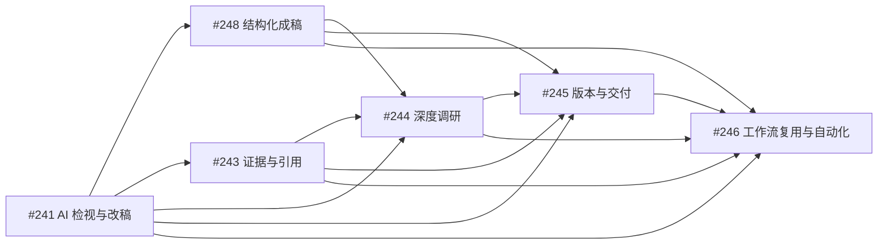

# Typola AI 文档工作台场景化规划

> 更新日期：2026-07-13  
> 总规划：#231  
> 规划原则：从用户进入产品时拥有的输入和期望结果出发，不按技术对象或文档名称平铺能力。

---

## 1. 规划结论

从第一性原理看，专业文字工作的核心区别不在于“技术方案、周报、公众号文章、决策备忘录”等文档名称，而在于用户开始工作时手里拥有什么。

```text
我已经有一篇文档
→ 帮我检查并改好

我有想法、材料或一篇源文档
→ 帮我组织成一份新的专业文档

我只有一个复杂问题
→ 帮我研究清楚并形成可信结论
```

因此，Typola 的产品主线收敛为：

- 三个一级文字工作流；
- 两个共享底座；
- 一个后期复用与自动化能力。

具体文档类型和文档改编策略由场景 Skill 承载，不分别建设产品模块。

---

## 2. 产品定位

Typola 的核心护城河是以下能力组合：

```text
专业 Markdown 文档
＋ 本地文件所有权
＋ 本机智能体执行
＋ 修改可审阅、可撤销
＋ 结论可核验
＋ 多格式交付
```

推荐定位：

> **Typola 是面向专业知识工作者的本地 AI 文档工作台，帮助用户把已有文档改好、把想法和材料写成专业文档，并从复杂问题形成可信研究与决策产物。**

近期核心心智：

> **能够依据明确标准，安全检视和修改整篇专业文档的本地 AI 写作工作台。**

产品原则：

1. 文档是最终产物，对话是过程沟通；
2. 用户结果优先于模型能力展示；
3. 重要修改必须可理解、可选择、可撤销；
4. Skill、style.md 和工具是实现手段，不是默认用户心智；
5. 先验证具体工作流，再抽象复用平台。

---

## 3. 三个一级文字工作流

## 3.1 AI 检视与针对性改稿

对应 Issue：#241

### 用户输入

- 一篇已经存在的文档；
- 可选的本次自然语言要求；
- 可选的工作区 `style.md`；
- 可选的专业检视或改稿 Skill。

### 用户目标

在不改变事实和核心观点的前提下，发现真正影响交付质量的问题，并以可审阅方式修改当前文档。

### 标准来源

```text
系统通用质量底线
＋ 用户本次要求
＋ style.md
＋ 指定 Skill
＝ 本轮检视与改稿标准
```

### 完整流程

```text
选择选区、章节或全文
→ 指定检视与改稿标准
→ AI 发现高价值问题
→ 生成针对性修改组
→ 用户逐项接受、拒绝或重写
→ 安全应用到当前文档
→ 形成可恢复的修订版本
```

### “改得好”的标准

- 重要问题优先于问题数量；
- 明确改善优先于同义改写；
- 忠于作者优先于模型偏好；
- 最小必要修改优先于全面重写；
- 降低审阅成本优先于展示 AI 能力；
- 用户接受什么，系统只应用什么。

### 产品边界

#241 负责修改当前文档。

如果目标是根据源文档创建另一份新文档，例如将调研报告转换为决策备忘录，应进入 #248 的派生文档模式，而不是覆盖当前文档。

---

## 3.2 结构化成稿

对应 Issue：#248

### 用户输入

三种输入形态：

1. 一个想法或一句需求；
2. 一组用户已经拥有的材料；
3. 一篇需要派生为其他用途的源文档。

### 用户目标

通过必要访谈、大纲确认和分章节生成，形成结构完整、目标明确、可以继续审阅的专业新文档。

### 完整流程

```text
明确目标与输入
→ 必要时结构化访谈
→ 生成并确认大纲
→ 分章节生成
→ 进入 #241 检视与改稿
→ 保存为新文档
→ 进入 #245 版本与交付
```

### 从想法成稿

用户提供：

- 文档目标；
- 目标读者；
- 核心观点；
- 已知约束；
- 目标文档类型；
- 篇幅和输出格式。

关键信息不足时先提问，不直接生成空泛长文。

### 从材料成稿

系统只执行当前成稿所需的材料整理：

- 提取与目标相关的信息；
- 去重和归类；
- 识别明显冲突；
- 识别信息缺口；
- 不把无关材料强行写入正文。

这不扩展为独立文档理解、提取和比较产品。

### 从源文档派生新文档

文档改编通过场景 Skill 完成：

```text
深度调研报告 + 决策备忘录 Skill → 决策备忘录
技术方案 + 高管摘要 Skill → 高管摘要
技术文章 + 公众号文章 Skill → 公众号稿
会议记录 + 正式纪要 Skill → 会议纪要
```

派生模式必须：

- 保留源文档；
- 创建新文档；
- 记录源文档和源版本；
- 记录使用的场景 Skill；
- 不允许无依据新增事实。

### 场景 Skill

Skill 可以定义：

- 必需输入；
- 澄清问题；
- 推荐结构；
- 信息选择规则；
- 是否允许压缩、扩展或重组；
- 使用的 style.md；
- 输出模式；
- 质量检查规则；
- 交付格式。

首批建议验证：

- 技术方案；
- 技术文章；
- 项目复盘；
- 决策备忘录。

---

## 3.3 深度调研与决策形成

对应 Issue：#244

### 用户输入

一个复杂、开放、目前没有足够材料和明确答案的问题。

### 用户目标

主动搜集资料、评价来源、综合支持与反对证据、处理冲突和不确定性，并形成可核验结论和决策产物。

### 完整流程

```text
提出研究问题
→ 拆解子问题
→ 搜集本地、网页和 GitHub 来源
→ 评价来源
→ 提取支持与反对证据
→ 处理冲突、缺口和不确定性
→ 形成可信结论
→ 通过 #248 生成研究与决策文档
→ 通过 #241 检视和改稿
→ 进入 #245 交付
```

### 与结构化成稿的边界

```text
用户已经提供主要材料，希望组织成文档 → #248
用户只有问题，需要主动寻找答案和外部证据 → #244
```

#244 负责研究和结论形成；大纲确认、分章节生成和派生文档复用 #248；最终文档检视和修改复用 #241。

### 首批旗舰任务

- 技术竞品调研；
- 开源项目深度调研；
- 技术选型与决策备忘录。

---

## 4. 两个共享底座

## 4.1 证据与引用

对应 Issue：#243

### 职责

- 保存真实来源、位置和原文片段；
- 将证据关联到关键结论；
- 将证据关联到检视问题和修改项；
- 支持点击引用核验；
- 显示来源冲突和失效；
- 在导出时保留参考来源。

### 边界

```text
#241：发现“这句话可能缺少依据”
#243：保存“依据是什么”并支持核验
#244：主动搜集、评价和综合证据
```

### 不建设

- 完整文献管理器；
- 知识图谱；
- 通用网页收藏；
- 通用上下文管理；
- 自动持续刷新来源。

---

## 4.2 文档版本与交付中心

对应 Issue：#245

### 职责

- 原稿、AI 修订和人工修订；
- 修改前安全快照；
- 新建文档和派生文档；
- 源文档、源版本和场景 Skill；
- 历史版本恢复；
- PDF、Word、HTML、微信和演示文稿；
- 交付物来源版本和来源场景。

### 派生关系

```text
源文档
  ├→ 决策备忘录
  ├→ 高管摘要
  └→ 演示文稿
```

派生后的文档形成独立版本链；源文档变化不会自动重写派生文档。

### 差异能力边界

保留版本安全所需的差异查看和现有差异功能，但不扩展为独立多文档理解、提取和比较工作台。

---

## 5. 后期能力：工作流复用与自动化

对应 Issue：#246

### 产品原则

> 先完成并验证具体文字工作，再从成功任务中保存配方；不先建设一个宽泛流程平台。

### 对象关系

```text
场景 Skill：具体任务怎么做
文档配方：把 Skill、输入、步骤和输出组合成可复用流程
文档任务：这一次流程正在执行什么
自动化：什么时候自动发起任务
```

### 第一阶段：配方与可恢复任务

- 从 #241、#248、#244 的成功任务保存配方；
- 从配方创建任务；
- 保存和恢复任务状态；
- 暂停、继续和失败重试；
- 交付 2～3 个真实可用配方。

### 第二阶段：后台队列与权限

- 多任务队列；
- 应用重启恢复；
- 高风险操作确认；
- 权限使用记录；
- 完成、失败和待审阅通知。

### 第三阶段：低风险定时触发

- 定时生成草稿；
- 防止重复触发；
- 触发历史；
- 待审阅通知。

当前不建设文件变化后自动重写正文的持续维护工作流。

---

## 6. 最终模块结构

| 优先级 | 类型 | 模块 | Issue |
|---:|---|---|---|
| 1 | 核心场景 | AI 检视与针对性改稿 | #241 |
| 2 | 核心场景 | 结构化成稿 | #248 |
| 3 | 共享底座 | 证据与引用 | #243 |
| 4 | 旗舰场景 | 深度调研与决策形成 | #244 |
| 5 | 共享底座 | 文档版本与交付中心 | #245 |
| 6 | 后期能力 | 工作流复用与自动化 | #246 |



---

## 7. style.md、Skill、工作流和配方

## 7.1 style.md

定义长期表达规范：

- 目标读者；
- 文风和语气；
- 术语表；
- 禁止表达；
- 结构和引用规则。

它是 #241、#248 和 #244 的可选输入，不建设独立产品中心。

## 7.2 场景 Skill

定义具体任务怎么做：

- 优先检查什么；
- 需要哪些输入；
- 如何组织文档；
- 是否允许结构调整；
- 输出修改当前文档还是创建新文档；
- 如何判断结果是否达标。

## 7.3 一级工作流

决定用户当前正在完成哪类任务：

```text
修改当前文档 → #241
创建新文档 → #248
主动研究并形成结论 → #244
```

## 7.4 文档配方

在具体流程被验证后，将 Skill、style.md、输入、步骤、权限和输出保存为可重复执行流程，由 #246 承载。

---

## 8. 页面信息架构

```text
左侧：文件与场景入口
中间：文档编辑器
右侧：当前场景工作面板
底部：按需展开的执行详情
```

文档始终是视觉中心。

聊天只用于：

- 补充要求；
- 回答 AI 提问；
- 解释判断和修改；
- 调整执行方向。

聊天不承担：

- 修改管理；
- 大纲和章节进度管理；
- 证据管理；
- 版本管理；
- 产物管理。

### #241 右侧面板

```text
AI 检视与改稿
├ 本轮标准
├ 高优先级问题
├ 其他问题
├ 待审阅修改组
├ 已接受
├ 已拒绝
└ 完成与导出
```

### #248 右侧面板

```text
结构化成稿
├ 文档目标
├ 输入材料
├ 待补充信息
├ 大纲
├ 章节进度
├ 检视与修改
└ 完成与交付
```

### #244 右侧面板

```text
深度调研
├ 研究定义
├ 研究计划
├ 来源
├ 证据与冲突
├ 结论
├ 报告与派生文档
├ 检视与修改
└ 交付物
```

---

## 9. 近期明确不做

- 独立 style.md 或文风管理中心；
- 独立文档改编与派生工作流；
- 独立文档理解、总结、提取和比较工作台；
- 来源变化后的持续维护和自动增量更新；
- 可检查的通用上下文产品；
- Notion 式数据库；
- Obsidian 知识图谱；
- 无限画布；
- 多人实时协作；
- 通用聊天客户端；
- 大型 Skill 或配方市场；
- 通用电脑操作智能体；
- 多智能体自由协作；
- 完整学术文献管理器。

说明：

- 当前成稿所需的材料提取属于 #248 的内部步骤；
- 版本安全所需的差异查看属于 #245；
- 文档改编通过场景 Skill 的派生模式完成；
- 这些内部能力不扩展为新的一级工作流。

---

## 10. 里程碑

## 10.1 高质量 AI 检视与改稿

主 Issue：#241

成功标志：

> 用户可以依据本次要求、style.md 或 Skill，完成高价值问题发现、针对性修改、逐项审阅和安全应用。

## 10.2 从想法和材料结构化成稿

主 Issue：#248

成功标志：

> 用户可以从一个想法或若干材料出发，经过必要访谈、大纲确认、分章节生成和统一改稿，形成可交付的新文档。

## 10.3 可信文档底座

主 Issue：#243、#245

成功标志：

> 关键结论可以回溯真实证据，文档修订、派生关系和交付物具有清晰血缘。

## 10.4 深度调研与决策形成

主 Issue：#244

成功标志：

> 用户可以从复杂问题出发形成可核验结论，并生成调研报告和决策备忘录。

## 10.5 工作流复用与自动化

主 Issue：#246

成功标志：

> 用户可以把一项成功文字任务保存为本地配方，并创建可恢复、权限受控的重复任务。

---

## 11. 指标

北极星指标：

> **每周通过 Typola 成功完成并交付的专业文档任务数量。**

一次完成至少要求：

- 修改或创建一份文档；
- 用户完成至少一次审阅或核验；
- 形成一个保存版本；
- 形成一个交付物。

关键质量指标：

- AI 修改被接受后再次被用户改掉的比例；
- 事实错误和作者意图偏移率；
- 高价值问题识别准确率；
- 从材料到正式成稿的完成率；
- 关键结论的证据覆盖率；
- 用户完成任务所需时间。

---

## 12. Issue 迁移

| Issue | 处理 |
|---|---|
| #241 | 重写为统一 AI 检视与针对性改稿，吸收 #242 |
| #242 | 已关闭并合并到 #241 |
| #248 | 新增结构化成稿核心场景 |
| #243 | 更新为证据与引用共享底座 |
| #244 | 更新为深度调研与决策形成，复用 #248 与 #241 |
| #245 | 增加派生文档和 Skill 血缘，收缩为版本与交付底座 |
| #246 | 收缩为后期工作流复用与自动化，不建设持续维护 |

---

## 13. 最终路线

```text
第一步：把已有文档按明确标准改好
  #241 AI 检视与针对性改稿

第二步：把想法、材料或源文档写成新文档
  #248 结构化成稿

第三步：让关键结论和交付物可信可追溯
  #243 证据与引用
  #245 文档版本与交付中心

第四步：从复杂问题形成可信研究和决策
  #244 深度调研与决策形成

第五步：将成功流程保存并重复执行
  #246 工作流复用与自动化
```

> **Typola 不按文档类型堆功能，而围绕“改好、写成、研究清楚”三个核心文字任务建立完整闭环；具体文档类型和改编策略由场景 Skill 承载。**