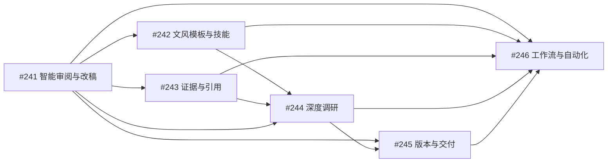

# Typola AI 文档工作台场景化规划

> 更新日期：2026-07-13  
> 总规划：#231  
> 规划原则：从用户真实任务出发，不按技术对象或底层能力平铺功能。

---

## 1. 规划重构背景

上一版规划将“整篇改稿、质量审查、证据、任务、版本、写作规范、配方、研究、自动化”拆成九个平行模块。进一步从用户使用场景分析后，发现其中存在两类问题：

1. 同一个用户闭环被拆成多个平行模块，例如质量审查、修改集、轻量任务和最小版本保护本质上共同服务“把已有文档改好”；
2. 多个层级不同的能力被并列，例如文档配方、文档任务和自动化其实是递进关系，而不是三条独立产品线。

新规划采用以下拆分原则：

- **场景 Issue**：必须独立形成一条完整、可验收的用户价值链路；
- **共享能力 Issue**：只负责被多个场景复用的数据与交付能力；
- **技术对象**：修改集、任务状态、版本节点等不再作为独立产品模块；
- **底层能力后置**：模型、技能、MCP、插件和命令行作为实现手段，不作为默认用户心智。

---

## 2. 产品定位

Typola 的核心护城河不是单项能力，而是以下组合：

```text
专业 Markdown 文档
＋ 本地文件所有权
＋ 本机智能体执行
＋ 修改可审阅、可撤销
＋ 结论可核验
＋ 多格式交付
```

推荐产品定位：

> **Typola 是面向专业知识工作者的本地 AI 文档工作台，帮助用户安全改好已有文档、完成深度调研，并将成熟文档流程沉淀为可复用的本地工作流。**

近期最需要抢占的用户心智：

> **能够安全审阅和修改整篇专业文档的本地 AI 写作工作台。**

---

## 3. 用户真实任务

### 3.1 场景一：把已有专业文档改好

典型用户已经拥有一篇技术方案、产品文档、调研稿、项目复盘或技术文章，希望在保留原有观点的前提下提高质量。

```text
打开已有文档
→ 全面检查或全面优化
→ 查看可定位的问题
→ 审阅 AI 修改
→ 接受、拒绝或要求重写
→ 安全应用
→ 形成可恢复的新版本
→ 导出交付
```

这是 Typola 当前底座复用率最高、用户感知最强、最难被普通聊天产品替代的核心场景。

对应 Issue：#241

### 3.2 场景二：按目标文风定向改稿

用户经常重复提出相同的表达要求，例如“严谨但有人味”“降低情绪化表达”“改成决策备忘录”“统一团队术语”。

```text
选择 style.md 或文风技能
→ 选择选区、章节或全文
→ 选择检查、优化或重塑
→ 选择改稿强度
→ 生成可解释修改
→ 逐项审阅
→ 形成修订版本
```

该场景将本地规则文件、技能和统一改稿出口结合，符合 Typola 的本地优先和 Markdown 原生定位。

对应 Issue：#242

### 3.3 场景三：完成深度调研并形成决策产物

用户只有一个复杂问题，需要 Typola 主动搜集资料、建立证据链、处理冲突与不确定性，并形成可信结论。

```text
提出研究问题
→ 拆解子问题
→ 搜集本地、网页和 GitHub 来源
→ 评价来源
→ 提取和综合证据
→ 处理冲突与信息缺口
→ 形成结论
→ 生成调研报告和决策产物
→ 审阅与交付
```

深度调研是一级旗舰工作流；调研报告、竞品分析、技术选型、决策备忘录和演示文稿是不同输出。

对应 Issue：#244

### 3.4 场景四：重复完成成熟文档工作

用户完成过一次成熟流程后，希望保存并重复使用，而不是重新组织提示词、步骤和输出要求。

```text
完成一次文档工作
→ 保存为本地配方
→ 后续创建具体任务
→ 后台执行
→ 需要用户时暂停审阅
→ 交付
→ 可定时或按文件变化触发
```

该场景采用递进对象：

```text
文档配方：这类工作应该怎么完成
文档任务：这一次正在完成什么
自动化：什么时候自动开始完成
```

对应 Issue：#246

---

## 4. 共享能力

### 4.1 证据与引用

证据不是独立写作场景，而是深度调研、专业改稿和决策文档共同需要的可信基础。

职责：

- 保存真实来源和原文片段；
- 将来源关联到结论、审查问题和修改项；
- 点击引用跳转核验；
- 显示来源失效或冲突；
- 导出时保留参考来源。

边界：

```text
智能审阅：发现结论可能缺少依据
证据与引用：保存依据并支持核验
深度调研：主动搜集和综合证据
```

对应 Issue：#243

### 4.2 版本与交付中心

版本与交付中心只负责记录文档如何演进，以及最终产物来自哪个版本。

职责：

- 原稿、修改集、修订版本和人工调整；
- 版本比较与安全恢复；
- PDF、Word、HTML、微信和演示文稿；
- 产物来源版本和来源场景；
- 与现有产物中心平滑整合。

边界：

```text
场景模块负责生成内容和修改
版本与交付中心负责保存结果之间的血缘关系
```

对应 Issue：#245

---

## 5. 六个规划模块

| 优先级 | 类型 | 模块 | Issue |
|---:|---|---|---|
| 1 | 核心场景 | 智能审阅与改稿 | #241 |
| 2 | 增强场景 | 文风模板与定向改稿技能 | #242 |
| 3 | 共享能力 | 证据与引用 | #243 |
| 4 | 旗舰场景 | 深度调研工作流 | #244 |
| 5 | 共享能力 | 版本与交付中心 | #245 |
| 6 | 平台化场景 | 文档工作流与自动化 | #246 |

依赖关系：



---

## 6. 里程碑规划

### 里程碑一：受控改稿

目标：证明 Typola 可以安全处理整篇专业文档。

范围：

- 全面检查和全面优化；
- 可定位文档问题；
- 结构化多处修改；
- 正文高亮；
- 逐项接受、拒绝和重写；
- 修改失效保护；
- 修改前后最小版本；
- 最终导出。

主 Issue：#241

成功标志：

> 用户可以完成“发现问题—审阅修改—部分接受—形成修订版本—导出”的完整闭环。

### 里程碑二：定向文风与可信文档

目标：让 Typola 能遵循稳定文风，并让关键结论可以被核验。

范围：

- 工作区 style.md；
- 文风技能；
- 选区、章节和全文定向改稿；
- 轻度、中度改稿；
- 修改原因引用规则；
- 来源、原文片段和引用跳转；
- 缺少依据检查；
- 引用导出。

主 Issue：#242、#243

成功标志：

> 用户可以用一套本地文风规则完成定向改稿，并从关键结论跳回真实来源。

### 里程碑三：深度调研旗舰工作流

目标：从复杂问题出发形成可信结论和决策产物。

范围：

- 研究定义；
- 子问题与研究计划；
- 本地、网页和 GitHub 来源；
- 来源评价；
- 支持证据、反对证据和冲突；
- 信息缺口与不确定性；
- 带引用大纲和报告；
- 调研报告、决策备忘录和演示文稿；
- 自动审阅和修改。

主 Issue：#244

成功标志：

> 用户可以完成一次技术选型或竞品研究，并得到可核验的调研报告和决策备忘录。

### 里程碑四：版本与交付中心

目标：让所有改稿、调研和导出结果形成清晰的文档演进脉络。

范围：

- 完整版本时间线；
- 场景来源；
- 任意版本比较；
- 安全恢复；
- 多格式产物来源版本；
- 与现有产物中心整合。

主 Issue：#245

成功标志：

> 用户不再依赖文件名判断原稿、修订稿和交付物的关系。

### 里程碑五：工作流与自动化

目标：将已经验证的文档工作沉淀为可复用、可恢复、可自动执行的本地工作流。

范围：

- 文档配方；
- 从配方创建任务；
- 从完成任务保存配方；
- 任务持久化和恢复；
- 后台队列；
- 权限和高风险确认；
- 定时和文件触发。

主 Issue：#246

成功标志：

> 用户可以将项目周报等成熟工作保存为配方，并在受控权限下重复或定时执行。

---

## 7. 页面信息架构

### 7.1 基本布局

```text
左侧：文件与工作流入口
中间：文档编辑器
右侧：当前场景工作面板
底部：按需展开的执行详情与终端
```

文档始终是视觉中心。

### 7.2 智能改稿工作面板

```text
本轮优化
├ 修改计划
├ 文档问题
├ 待审阅修改
├ 已接受
├ 已拒绝
└ 完成与导出
```

### 7.3 文风改稿工作面板

```text
文风模板
├ style.md
├ 文风技能
├ 作用范围
├ 改稿强度
├ 规则差异
└ 待审阅修改
```

### 7.4 深度调研工作面板

```text
深度调研
├ 研究定义
├ 研究计划
├ 来源
├ 证据与冲突
├ 结论
├ 报告大纲
├ 待审阅修改
└ 交付物
```

### 7.5 自动化任务工作面板

```text
文档任务
├ 目标
├ 输入
├ 当前步骤
├ 待确认事项
├ 审查与修改
├ 证据
├ 版本
└ 最终产物
```

聊天退回辅助交互角色，用于补充要求、回答问题和解释结果，不承担修改、版本、证据和任务管理。

---

## 8. 核心对象边界

### 修改集

不是独立产品模块，是所有 AI 文档修改的统一结果协议。

消费场景：

- 智能改稿；
- 文风技能；
- 深度调研报告后处理；
- 自动化任务中的文档修改。

### style.md

定义内容应该如何表达，不定义工作应该如何执行。

### 文风技能

定义如何将当前内容转换为目标风格，输出修改集。

### 证据记录

保存结论与真实来源之间的关系，不负责研究计划。

### 文档配方

定义一类文档工作如何完成。

### 文档任务

记录配方的一次具体执行。

### 自动化

定义任务何时触发和如何后台运行。

### 版本节点

记录场景执行后形成的文档和产物血缘。

---

## 9. 近期不做

- 通用上下文包管理；
- 上下文令牌估算和包含/排除控制台；
- Notion 式数据库；
- Obsidian 知识图谱；
- 无限画布；
- 多人实时协作；
- 通用聊天客户端；
- 大型技能市场；
- 快速增加大量模型提供方；
- 大量固定润色按钮；
- 通用电脑操作智能体；
- 多智能体自由协作；
- 与文档无关的通用自动化；
- 复杂学术文献管理器。

---

## 10. 产品指标

### 北极星指标

> 每周成功完成并交付的专业文档任务数量。

一次完成至少要求：

- 形成或修改一份文档；
- 用户完成至少一次审阅或核验；
- 形成一个保存版本；
- 形成一个交付物。

### 场景一指标

- 全面检查与全面优化发起率；
- 修改集生成成功率；
- 修改接受率、拒绝率和部分接受率；
- 修改失效率；
- 应用后撤销率；
- 从发起到形成修订版本的时间。

### 场景二指标

- style.md 启用率；
- 文风技能重复使用率；
- 文风修改接受率；
- 从示例文档生成模板后的保留率。

### 场景三指标

- 有效来源数量；
- 关键结论证据覆盖率；
- 冲突和信息缺口暴露率；
- 引用核验率；
- 调研报告到决策产物的转化率。

### 场景四指标

- 配方创建与复用率；
- 任务恢复成功率；
- 后台任务完成率；
- 自动触发后进入人工审阅的比例。

---

## 11. 工作量概览

| Issue | 模块 | 预估 |
|---|---|---:|
| #241 | 智能审阅与改稿 | 35～55 人日 |
| #242 | 文风模板与定向改稿技能 | 15～24 人日 |
| #243 | 证据与引用 | 18～30 人日 |
| #244 | 深度调研工作流 | 35～55 人日 |
| #245 | 版本与交付中心 | 15～25 人日 |
| #246 | 文档工作流与自动化 | 45～75 人日 |

工作量为大模块级预估，进入研发前还需按垂直切片拆成可独立验收的实施 Issue。

---

## 12. 旧规划迁移

旧 #232～#240 已由新场景化规划替代，关闭但保留历史讨论。

| 旧 Issue | 新归属 |
|---|---|
| #232 整篇可审阅改稿 | #241 |
| #233 文档质量审查 | #241 |
| #234 证据与引用 | #243 |
| #235 轻量文档任务 | 最小状态进入 #241，完整任务进入 #246 |
| #236 产物与版本时间线 | #245 |
| #237 写作规范 | #242 |
| #238 文档配方 | #246 |
| #239 研究模式 | #244 |
| #240 后台、权限和多智能体 | 后台与权限进入 #246；多智能体暂不进入主线 |

---

## 13. 最终路线

```text
第一步：把已有文档安全改好
  #241 智能审阅与改稿

第二步：按目标文风稳定改稿
  #242 style.md 与文风技能

第三步：让专业结论可核验
  #243 证据与引用

第四步：从复杂问题形成可信结论
  #244 深度调研工作流

第五步：管理文档演进与交付物
  #245 版本与交付中心

第六步：将成熟文档工作重复和自动完成
  #246 文档工作流与自动化
```

核心战略：

> **先建立用户一眼可感知的整篇文档审阅与改稿体验，再逐步增强文风、可信度、深度调研、交付血缘和自动化，不提前建设宽泛的通用智能体平台。**
