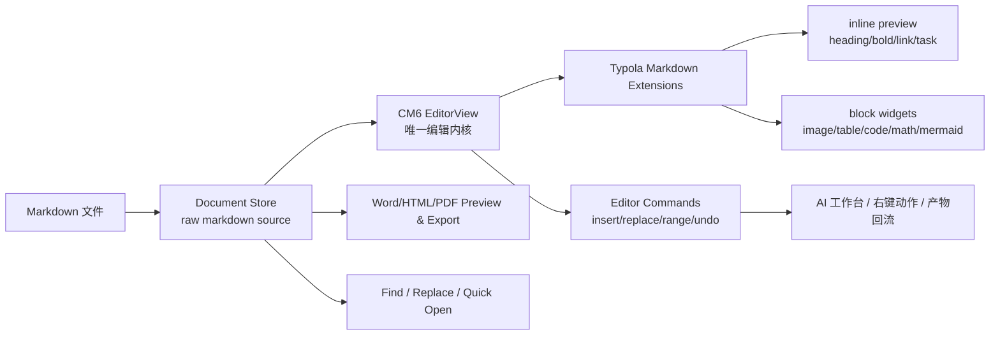

# Typola CM6 编辑器内核完整重构方案

> 日期：2026-06-29
> 状态：Phase 1 启动前方案
> 适用范围：Issue #105 / Issue #81 后续统一修复
> 目标：以 CodeMirror 6 作为 Typola 编辑器唯一内核，逐步替换 Vditor WYSIWYG 内核，同时保证现有产品能力不丢失。

## 1. 背景与问题

Typola 当前使用 Vditor 承担所见即所得 Markdown 编辑，源码模式使用 CodeMirror 6。这个组合在早期实现成本低，但随着 AI 工作台、选区改稿、产物回流、图片/代码块/Mermaid/PDF 导出等能力增加，Vditor IR 与真实 Markdown source 之间的错位已经成为核心复杂度来源。

当前主要问题：

- 选区定位不稳定：AI 替换需要依赖 `findUniqueAnchor` 等多层 fallback，遇到重复文本、格式标记、图片、代码块时容易失准。
- 代码块体验难以打磨：Vditor 的代码块渲染、编辑空行、语言选择弹层等行为较难做到接近 Typora。
- 富内容扩展受限：Mermaid、KaTeX、图片、表格、任务列表等能力需要绕过 Vditor 行为，容易产生 DOM 与 source 状态不一致。
- 性能边界不清晰：大文档下 Vditor 的同步渲染与 IR 操作难以细粒度控制，AI 流式和 watcher 叠加后风险更高。
- 双内核维护成本高：WYSIWYG 与源码模式分别走 Vditor / CM6，快捷键、选区、撤销、搜索、AI 注入都要做双份适配。

Phase 0 与 Phase 0.5 已验证：CM6 的 `EditorView + raw source transaction` 可以精确替换中文、加粗、代码、链接、重复文本，并能天然接入 undo/redo；`@atomic-editor/editor` 的 inline preview / 表格 / 图片 / task list 基础能力可运行；KaTeX 渲染管线与 block decoration 架构可行。

因此，后续重构应收敛到一个原则：

**Typola 编辑器以 CM6 raw Markdown source 为唯一事实源，所有 WYSIWYG、AI 编辑、预览、导出、搜索、选区动作都围绕同一份 source 与同一个 EditorView 编排。**

## 2. 重构目标

### 2.1 产品目标

- 保留现有 Typola 的核心能力：Markdown 所见即所得编辑、源码模式、文件树、多 tab、未保存保护、查找替换、快速打开、文档统计、编辑辅助、右键 AI 动作、AI 工作台、SkillHub、产物中心、终端、Word/HTML/PDF 导出。
- 编辑体验向 Typora 靠拢：正文直接编辑、格式即时预览、代码块自然展示与编辑、图片/Mermaid/公式在合适时渲染、光标进入时可编辑源码。
- AI 改稿链路稳定：选区、插入、替换、anchor 校验、产物覆盖/撤销都基于 CM6 position，而不是文本猜测。
- 大文档性能可控：仅渲染视口附近内容，富内容 widget 延迟渲染，避免全量同步 DOM 重建。
- 为后续 M3/M4 能力留接口：inline diff、AI 编辑原语、路径点击、态势感知、多 agent 可在 CM6 extension 层增量实现。

### 2.2 技术目标

- 新增 `Cm6MarkdownEditorPane`，最终替代 `WysiwygEditorPane`。
- 引入 `EditorCoreAdapter` 统一编辑器命令接口，屏蔽 Vditor/CM6 过渡期差异。
- 用 CM6 extension 构建 Typola Markdown live preview 能力，而不是依赖 Vditor IR。
- 用 `EditorView.dispatch` 统一处理插入、替换、AI 改稿、撤销、格式快捷键。
- 用 CM6 `StateField / ViewPlugin / Decoration / WidgetType` 承载图片、表格、任务列表、公式、Mermaid、代码块增强。
- 用 Playwright 建立真实浏览器输入与 IME 回归测试。
- Phase 结束时删除 Vditor runtime 依赖与相关兼容层，避免长期双栈。

## 3. 非目标

- 不做完整富文本编辑器，不引入 ProseMirror / Slate / Lexical。
- 不做块编辑器、Notion 式拖拽 block、数据库 block。
- 不在 Phase 1 直接重写 AI 工作台整体交互。
- 不在 Phase 1 删除 Vditor，必须先灰度并验证全量能力。
- 不为了兼容旧实现保留 Vditor IR 数据模型。
- 不做历史文档迁移，Markdown 文件本身就是兼容边界。

## 4. 终态架构



### 4.1 核心模块

| 模块 | 职责 |
|------|------|
| `Cm6MarkdownEditorPane` | React 组件，创建和持有 EditorView，负责和 AppLayout 通信 |
| `editorCoreAdapter` | 统一编辑命令接口，提供 selection/range/insert/replace/undo/focus |
| `markdownLivePreviewExtensions` | 聚合 inline preview、表格、图片、任务列表、代码块、公式、Mermaid |
| `cm6CodeBlockExtension` | 代码块 Typora-like 展示与编辑 |
| `cm6ImageExtension` | 图片展示、远程图片、加载失败、alt/title、复制/打开 |
| `cm6MathExtension` | KaTeX inline/block 渲染，光标进入时源码编辑 |
| `cm6MermaidExtension` | Mermaid block widget，缓存渲染结果，失败可编辑源码 |
| `cm6SelectionActions` | 右键 AI 动作、anchor 快照、替换校验 |
| `cm6SearchBridge` | 查找/替换与 CM6 selection/search state 对接 |
| `cm6ExportBridge` | 导出前从 raw source 生成统一 HTML/AST |

### 4.2 唯一事实源

CM6 终态中，文档内容只以 raw Markdown source 存在：

- 编辑器展示是 source 的实时 decoration/widget 投影。
- 预览与导出从 source 解析生成 HTML/Word/PDF。
- AI 选区基于 `from/to/originalText`，替换前校验 raw source。
- 未保存状态比较 source 与 lastSavedSource。
- 撤销/重做使用 CM6 history。

这能避免 Vditor 场景下“DOM 看起来是 A，Markdown source 实际是 B”的漂移。

## 5. 能力不丢失清单

### 5.1 编辑基础能力

- 打开/保存/另存为 Markdown。
- 多 tab，未保存标记，关闭未保存确认。
- 新建未命名文档，多个未命名文档必须有稳定 id。
- 源码模式与所见即所得模式切换。
- 复制、粘贴、全选、撤销、重做。
- 快捷键：保存、查找、替换、粗体、斜体、代码、标题、列表等。
- 文件树打开、重命名、删除、新建文件。

### 5.2 Markdown 富内容

- 标题、段落、引用、分割线。
- 粗体、斜体、删除线、行内代码、链接。
- 有序/无序列表、任务列表。
- 代码块：语言标记、横向滚动、复制、自然编辑、无不可删除空行。
- 表格：基础展示与编辑。
- 图片：本地图片、远程图片、带 query 的 URL，例如微信公众号图片 URL。
- Mermaid：编辑态与渲染态切换，失败提示。
- KaTeX：inline `$...$` 与 block `$$...$$` / fenced math。

### 5.3 文档工作台能力

- 文档统计。
- 查找/替换，样式接近 Typora。
- 快速打开与最近文件。
- 编辑辅助。
- 右键 AI 动作：润色、改写、缩写、扩写、解释术语、自定义。
- AI 回复插入光标、替换选区、复制。
- anchor 替换校验：原文档、原范围、原文一致才允许覆盖。
- AI 产物列表、打开、对比、插入、覆盖原文、撤销覆盖。

### 5.4 预览与导出

- HTML 预览与导出。
- Word 预览与导出。
- PDF 导出后台执行，右上角通知成功/失败。
- Mermaid/图片/代码块/表格在导出中正确呈现。
- 导出不依赖编辑器 DOM 临时状态，而从 source 生成稳定 HTML。

### 5.5 跨平台与性能

- Windows/macOS 可用。
- 中文 IME 可用。
- 1k/5k/10k 行文档可编辑。
- 大文档滚动不明显卡顿。
- 富内容 widget 不阻塞输入。

## 6. 开源复用策略

优先复用成熟 CM6 extension，不做不必要自研。

| 能力 | 方案 | 说明 |
|------|------|------|
| Markdown parser | `@codemirror/lang-markdown` | 必选基座 |
| Inline preview / task list / table / image | `@atomic-editor/editor` | Phase 0.5 已验证，需接受 fork 兜底 |
| Fold gutter | `@codemirror/language` | 内置能力 |
| KaTeX | 参考 `codemirror-live-markdown`，产品内独立实现 | 不直接依赖整包，避免过度耦合 |
| Mermaid | 自研轻量 widget | 包装现有 `mermaid.render`，控制缓存和错误态 |
| Search | `@codemirror/search` 或自建轻封装 | 与 Typora-like UI 对接 |
| Commands/history | `@codemirror/commands` | undo/redo/快捷键 |

注意：

- `@atomic-editor/editor` 目前作为可选依赖验证，Phase 1 需要改为正式依赖或 vendor/fork 策略二选一。
- KaTeX 需要从 transitive dependency 改为直接 dependency。
- 从其他 MIT 项目提取代码时必须保留 license 说明，并更新 `NOTICE`。

## 7. 分阶段实施计划

### Phase 0：选型与 Spike（已完成）

目标：验证 CM6 作为唯一编辑内核的可行性。

完成项：

- 候选库调研：atomic-editor、codemirror-live-markdown、purrmd、rich-markdoc。
- CM6 raw source 选区替换测试。
- 大文档、撤销、中文边界初步验证。

产物：

- `docs/changes/2026-06-28-cm6-editor-spike--codex-handoff.md`
- `docs/changes/2026-06-28-cm6-editor-spike-integration.md`
- `docs/changes/2026-06-29-cm6-phase0.5-handoff.md`

### Phase 0.5：真实集成验证（已完成，需补一个测试卫生修复）

目标：把候选能力从“源码阅读”推进到“真实 import + EditorView + 测试”。

完成项：

- atomic-editor import 与 DOM 能力测试。
- KaTeX demo plugin 测试。
- EditorView replace/undo 测试。
- IME jsdom 事件层测试。
- 1k/5k/10k 性能基准。

进入 Phase 1 前必须修复：

- Vitest 需要排除 `src/experimental/cm6-editor-spike/candidates/**`，避免第三方候选仓库测试进入主测试套件。

### Phase 1：CM6 编辑器内核骨架

目标：新增 CM6 编辑器组件，但不替换默认编辑器。

步骤：

1. 新建 `src/components/editor/cm6/Cm6MarkdownEditorPane.tsx`。
2. 新建 `src/components/editor/cm6/createMarkdownExtensions.ts`。
3. 新建 `src/types/editorCore.ts`，定义统一接口：

```ts
export interface EditorCoreHandle {
  focus(): void;
  getMarkdown(): string;
  setMarkdown(markdown: string): void;
  getSelection(): { text: string; from: number; to: number } | null;
  insertText(text: string): void;
  replaceSelection(text: string): void;
  replaceRange(from: number, to: number, text: string): boolean;
  undo(): void;
  redo(): void;
}
```

4. AppLayout 增加隐藏实验入口或 feature flag：`editorEngine: 'vditor' | 'cm6'`。
5. 保持默认仍为 Vditor，CM6 只用于开发验证。
6. 接入保存、未保存状态、tab 切换、文件打开。
7. 跑现有单测，新增 CM6 adapter 单测。

验收：

- CM6 能打开/编辑/保存 Markdown。
- 多 tab 切换内容不丢。
- 未保存状态正确。
- undo/redo 可用。
- `npm run typecheck` / `npm test` 通过。

### Phase 2：Typora-like Markdown Live Preview

目标：补齐所见即所得基础编辑体验。

步骤：

1. 接入 atomic-editor `inlinePreview`、`tables()`、`imageBlocks()`。
2. 实现 task list 点击切换 source。
3. 实现代码块 extension：
   - 普通展示时是稳定代码块。
   - 光标进入代码块时可直接编辑 source。
   - 不出现不可删除空行。
   - 不弹无关语言选择框。
   - 支持横向滚动和复制。
4. 实现图片 extension：
   - 支持本地/远程 URL。
   - 支持带 query 参数 URL。
   - 加载失败显示可读错误和原始 URL。
5. 实现 Mermaid widget：
   - fenced `mermaid` 渲染。
   - 点击/光标进入回源码态。
   - 渲染失败保留源码可编辑。
6. 实现 KaTeX：
   - 直接加入 `katex` 依赖。
   - block math 用 StateField。
   - inline math 支持裸 `$...$`，不能长期停留在 `` `$...$` `` 权宜方案。

验收：

- 现有样本文档中的代码块、图片、Mermaid、表格、任务列表展示正常。
- 代码块上下无多余不可删空行。
- 微信图片 URL 可展示。
- Mermaid 与 KaTeX 失败时不破坏编辑。
- 大文档滚动无明显卡顿。

### Phase 3：编辑命令、查找替换与 AI 动作迁移

目标：把所有编辑命令切到 CM6 handle。

步骤：

1. 用 `EditorCoreHandle` 替换旧 `EditorCommandHandle` 调用点。
2. 右键 AI 动作基于 CM6 selection 创建 anchor：

```ts
type SelectionAnchor = {
  filePath: string;
  from: number;
  to: number;
  originalText: string;
};
```

3. 替换选区时校验：
   - 当前文件路径一致。
   - `doc.sliceString(from, to) === originalText`。
   - 通过后 `replaceRange`。
4. 查找/替换 UI 与 CM6 search state 对接。
5. 文档统计从 CM6 source 派生。
6. 快捷键全部走 CM6 keymap。
7. 保留源码模式，但源码模式变成 CM6 同内核的显示配置，而不是另一个编辑器。

验收：

- 润色/改写/缩写/扩写结果能准确替换原选区。
- 解释术语不强制替换。
- 查找默认只展示查找，展开后显示替换。
- Ctrl/Cmd+F、Ctrl/Cmd+H、Ctrl/Cmd+S、Ctrl/Cmd+K 正常。
- 撤销栈不被 AI 替换破坏。

### Phase 4：预览、导出与产物回流统一

目标：导出链路从 editor source 出发，避免依赖 Vditor DOM。

步骤：

1. 建立 `markdownToExportHtml(source, options)`。
2. HTML/Word/PDF 导出共用同一转换入口。
3. Mermaid/KaTeX/图片/代码块在导出 HTML 中稳定处理。
4. PDF 导出后台执行，右上角 toast 成功/失败。
5. AI 产物打开进入 CM6 tab。
6. 产物覆盖原文使用 `replaceDocument` 或文件写入后刷新 CM6 source。

验收：

- HTML/Word/PDF 导出内容一致。
- PDF 导出不阻塞主 UI。
- 产物覆盖/撤销后编辑器内容同步。
- 导出失败有明确错误提示。

### Phase 5：灰度切换与 Vditor 下线

目标：默认启用 CM6，并删除 Vditor。

步骤：

1. 内部 feature flag 默认切到 CM6。
2. 完成 Windows/macOS smoke。
3. 删除 Vditor 相关组件和样式。
4. 删除 `public/vditor/dist/` 和 `vditor` 依赖。
5. 清理旧的 Vditor workaround、IR anchor、双模式兼容分支。
6. 更新 README、CHANGELOG、docs/ARCHITECTURE.md。

验收：

- 全量测试通过。
- Windows/macOS 打包通过。
- 现有功能清单全部通过人工 smoke。
- 包体积不因临时双栈长期膨胀。

## 8. 测试计划

### 8.1 单元测试

- EditorCoreHandle：selection、insert、replace、replaceRange、undo、redo。
- Markdown extensions：代码块、图片、表格、task list、math、Mermaid。
- AI anchor：路径不一致、原文变化、范围变化、正常替换。
- Search bridge：查找、下一处、上一处、替换、全部替换。
- Export bridge：Markdown source 到 HTML 的稳定输出。

### 8.2 E2E / Playwright

- 中文 IME 输入。
- 代码块内输入、删除、换行、撤销。
- 图片粘贴/展示。
- Mermaid 源码编辑与渲染失败恢复。
- AI 右键动作注入 Composer。
- AI 回复替换原选区。
- 多 tab 未保存关闭确认。
- 大文档滚动与查找。
- PDF/Word/HTML 导出 smoke。

### 8.3 性能基准

| 场景 | 目标 |
|------|------|
| 1k 行打开 | < 500ms |
| 5k 行打开 | < 1500ms |
| 10k 行打开 | 可交互，无明显白屏 |
| 单次 replace | < 50ms |
| 滚动长文档 | 不明显掉帧 |
| Mermaid/KaTeX 多块文档 | 延迟渲染，不阻塞输入 |

## 9. 风险与缓解

| 风险 | 等级 | 缓解 |
|------|------|------|
| atomic-editor 上游停更 | 中 | 保留 fork/vendor 预案，只使用核心 extension |
| 裸 `$...$` 解析复杂 | 中 | Phase 2 单独里程碑处理，不阻塞基础编辑器 |
| 表格编辑体验不及 Typora | 中 | 先保基础展示/编辑，再逐步增强表格快捷操作 |
| IME 浏览器行为与 jsdom 不一致 | 高 | 必须 Playwright 手测和自动化覆盖 |
| Vditor/CM6 双栈期间状态不一致 | 中 | feature flag 单向切换，避免同一文档双编辑器同时活跃 |
| 导出依赖旧 DOM | 高 | Phase 4 明确改为 source -> HTML，不从编辑器 DOM 抓取 |
| 大文档富内容 widget 太多 | 中 | viewport 内渲染、缓存、失败降级 |

## 10. 工程纪律

- 每个 Phase 单独分支、单独 PR。
- 每个 Phase 都必须更新 `CHANGELOG.md`；涉及架构变化同步 `docs/ARCHITECTURE.md`。
- 不在同一 PR 同时做编辑器内核和 UI 大改版。
- 不修改测试来适配错误行为；测试红先查根因。
- 不让 Vditor fallback 成为长期架构。
- 所有第三方代码复用必须记录 license 与来源。

## 11. 建议分支与 PR 切分

| PR | 分支 | 内容 |
|----|------|------|
| PR-1 | `codex/cm6-phase1-core` | CM6 editor pane + adapter + feature flag |
| PR-2 | `codex/cm6-phase2-live-preview` | inline preview / code block / image / table / math / mermaid |
| PR-3 | `codex/cm6-phase3-ai-commands` | AI selection / search / shortcuts / source mode unified |
| PR-4 | `codex/cm6-phase4-export-artifacts` | export bridge / artifact回流 |
| PR-5 | `codex/cm6-phase5-vditor-removal` | 默认切换 CM6 + 删除 Vditor |

## 12. Phase 1 开始前检查清单

- [ ] 修复 Vitest 排除候选仓库测试的问题。
- [ ] 决策 `@atomic-editor/editor` 是正式依赖还是 vendor/fork。
- [ ] 把 `katex` 加为直接依赖。
- [ ] 明确 CM6 feature flag 的设置位置。
- [ ] 列出用于人工 smoke 的 Markdown 样本文档。
- [ ] 确认 Phase 1 不修改默认用户编辑器。

## 13. 最终验收标准

CM6 重构完成后，Typola 应满足：

- 用户打开 Markdown 后默认进入 CM6 所见即所得编辑。
- 所有编辑、AI 改稿、查找替换、导出都基于同一份 raw Markdown source。
- 代码块、图片、Mermaid、KaTeX、表格的编辑和展示体验达到 Typora 级别的基础可用水准。
- 选区 AI 替换不再依赖文本猜测，重复文本和格式标记下仍精确。
- Vditor 依赖、资源、兼容层全部删除。
- Windows/macOS 打包通过，主流程 smoke 通过。

## 14. 结论

Typola 应从“Vditor WYSIWYG + CM6 源码模式”的双内核架构，收敛到“CM6 raw source 唯一内核 + live preview extensions”的统一架构。

这次重构不是单纯替换编辑器组件，而是把 Typola 的文档编辑、AI 改稿、富内容展示、导出和产物回流统一到同一条数据流上。短期投入更大，但能一次性解决选区不准、代码块体验差、富内容难扩展、导出依赖 DOM、双栈维护成本高这些结构性问题。

建议 Phase 1 只做 CM6 骨架和 adapter，不急于删除 Vditor；等 Phase 2/3 把富内容和 AI 命令跑通后，再进入默认切换与 Vditor 下线。
