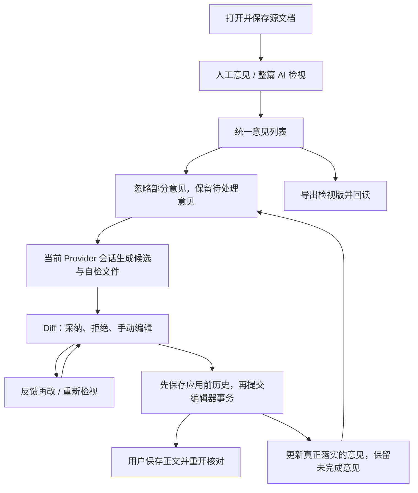

# AI 工作台与智能检视：实现审视及测试建设设计

状态：设计稿；未实施、未运行 exe、未调用真实 AI。代码审视基线为 `ad1f27b8b7d6893a24ce6ea2883f364896bd0149`，审视开始时工作树干净。

## 1. 目标与本次边界

交付可维护的测试地图和可执行用例，主要通过真实 Typola Windows exe 操作，Claude Code 与 OpenCode 分别完成实际业务链路。重点保证检视从创建、处理意见、改稿、审阅到保存交付，以及中途退出后继续处理。AI 工作台的会话、上下文、Provider、SkillHub、产物、取消和诊断同时纳入覆盖。

本轮只交付实现审视和完整设计。后续测试建设与产品修复分开验收：测试可以诚实失败，不能为了绿色结果降低产品预期；发现产品缺口不自动授权修改产品。

已确定的范围：

- 不评比模型文采、问题发现率或误报率；但必须验证返回格式、可定位性、修改范围、文件副作用和用户操作结果。
- 不新增独立 AI 工作区，不重写 Diff，不建设通用测试平台，不引入文档分支或多候选并行比较。
- 普通保存仍遵守正文的现有保存规则，默认不自动保存正文。检视工作进度独立持久化。
- 用户最新决定：忽略是终态，不支持恢复。保留已忽略记录供查看；不参与后续改稿和默认导出。重启后恢复工作进度不等于把已忽略意见改回待处理。
- 不把 Provider 不可用、原生对话框无法驱动或未执行场景记成通过。

## 2. 依据与当前实现模型

事实以 `docs/ARCHITECTURE.md` 为准；`AI_REVIEW_DESIGN.md` 描述候选稿持续改稿，`AI_REVIEW_INTERACTION_SPEC.md` 描述意见列表和导出回读。`AI_WORKBENCH_SPEC.md` 在架构文档中明确标为 2026-06-16 历史快照，不能作为当前工作台测试契约。

本设计中的目标行为是建议采用的后续验收契约，不表示现有产品已经实现。旧规格中的“忽略可恢复”被用户本次决定取代；实施时应同步相关规格、架构事实和既有测试，不能同时保留相反约定。

### 2.1 真实入口不能混为一谈

| 入口 | 当前职责 | 测试边界 |
| --- | --- | --- |
| 选区浮条“加检视意见” | 为选区创建人工批注，不调用 AI | 选区与 Markdown 锚点、批注编辑、定位 |
| 右栏“AI 检视” | 根据规则文件、Skill 名称、手工要求检查当前文档 | 整篇 AI 检视、结构化结果入列 |
| 右栏“AI 改稿” | 收集待处理意见，生成完整候选文件和自检结果 | 意见驱动改稿、自动进入 Diff |
| 选区/章节/全文改稿入口 | 根据范围和请求生成候选稿 | 范围、重大改动确认；不假称是侧栏选区检视 |
| 工作台自由对话及产物 | 发送请求、返回消息和文件 | 自由产物不能因内容像改稿就自动替换正文 |

### 2.2 运行链路



主要状态各有归属：

- `useReviewState` 用按文档路径索引的内存 Map 保存意见。
- `AppLayout` 组装检视/改稿请求，用 ref 记录当前请求及待应用意见关联，消费会话结果。
- `useDiffReview` 管候选、逐处决定、自检、基线过期和应用；当前用 localStorage 保存候选。
- Provider-bound Conversation 管 CLI 会话、消息与 resume；不应成为意见的唯一所有者。
- 正文保存、候选文件、历史文件、导出检视版是不同产物，必须分别核对。

### 2.3 当前代码证据

下列位置以本次基线为准。源码结论不是 exe 复现结果。

| 编号 | 事实或问题 | 证据 | 判断 |
| --- | --- | --- | --- |
| F01 | 意见保存在 React 内存 Map；没有普通文档意见的持久化读写 | `src/hooks/useReviewState.ts:39`；`AppLayout.tsx:523` 只从检视版元数据回填 | 重启继续检视的产品缺口 |
| F02 | 忽略数用“全部减待处理”计算，会把已应用意见算进去 | `ReviewSidebarPanel.tsx:123` | 确定的计数接线缺陷 |
| F03 | 导出按钮和 AI 改稿共用待处理数量门槛；全部已应用后导出被禁用 | `ReviewSidebarPanel.tsx:126,503`；`reviewState.ts:123` 的导出集合包含已应用项 | 确定的 UI/服务契约冲突；组件测试还断言了错误门槛 |
| F04 | 忽略按钮始终传 true | `ReviewSidebarPanel.tsx:482` | 按用户最新决定，不是缺陷；终态项应避免误导性的重复操作 |
| F05 | 已应用的判断只检查旧锚点原文是否在合并稿任意位置出现 | `reviewState.ts:151` | 无法可靠归因：相同原文在别处残留会漏标，其他改动删除原文可能误标 |
| F06 | 候选与待处理意见的关联只放在 ref | `AppLayout.tsx:652,1023,1156` | 候选恢复后不能靠该 ref 恢复意见处理关系 |
| F07 | 发起改稿成功即 `markClean()`，此时并未持久化意见 | `AppLayout.tsx:1028` | “检视意见已保存”的 UI 含义与事实不符 |
| F08 | 检视设置是侧栏局部 state，Skill 选项从场景汇总而来 | `ReviewSidebarPanel.tsx:255`；`AppLayout.tsx:577` | 设置生命周期、实际安装及 Provider 能力需单列验证 |
| F09 | AI 检视无 requestId/sourceHash；完成时取会话最后一条 assistant，当前文档切换就不入列 | `AppLayout.tsx:831,864` | 请求归属和切文档期间结果丢失风险，需运行验证 |
| F10 | 检视结果条目不合法时过滤；全部过滤可得到空列表 | `aiReviewResult.ts:9` | “没有意见”和“返回结构损坏”应分开报告 |
| F11 | 删除服务存在，但侧栏无删除接线；意见编辑器禁止保存空文本 | `useReviewState.ts:75`；`ReviewCommentEditor.tsx:90`；`AppLayout.tsx:2902` | 规格要求删除，但当前用户路径不完整 |
| F12 | 当前 exe 套件只打开检视面板，跳过完整意见与 Diff 路径 | `.nimo/verification/scripts/verify-exe-core-suite.mjs:682` | 已有局部测试不能替代真实闭环证据 |

现有可复用单测包括 `reviewState*.test.ts`、`aiReviewResult.test.ts`、`documentHistoryService.test.ts`、`useDiffReview.agentic.test.tsx`、`ReviewSidebarPanel.agentic.test.tsx`、`DiffReviewPane.agentic.test.tsx`。本轮只阅读，没有执行。尤其不能把 service 支持忽略/删除、hook 支持恢复候选，扩大为完整 UI 已支持。

## 3. 用户路径与完成标准

### 3.1 正常主路径

打开已保存 Markdown → 创建检视 → 真实 Provider 返回可定位意见 → 用户补充/编辑人工意见并忽略不采纳的意见 → 按待处理意见生成候选 → 审阅并部分采纳 → 应用 → 保存 → 重开 → 继续处理剩余意见 → 导出最终检视版。

需要分别证明：

1. 请求结束：Provider 本轮停止，结果已归入所属文档和请求。
2. 候选应用：编辑器收到用户最终选择的内容，应用前历史可读取。
3. 正文保存：磁盘和重新打开的正文匹配用户选择。
4. 本轮意见处理完成：已经成功完成至少一轮检视，没有运行中或中断未处理的请求，没有未决候选，且该轮不存在待处理或定位失效待确认的意见。零意见的成功检视可以完成；未执行、失败、取消不能冒充零问题完成。

“本轮处理完成”只表达操作结果，不承诺文档质量。删除作为明确移除记录，不伪装为已应用；测试中保留该用户动作的证据。

### 3.2 意见状态

采用一个明确的处理状态，避免 `active` 与 `appliedAt` 混用导致计数分歧。

| 状态 | 可做的事 | 参与 AI 改稿 | 默认导出 |
| --- | --- | --- | --- |
| 待处理 | 定位、人工意见编辑、忽略、删除 | 是；失效锚点先提示 | 是 |
| 已应用 | 查看、定位历史原文、删除 | 否 | 是，保留状态 |
| 已忽略 | 查看、删除 | 否 | 否 |

本轮不提供忽略恢复，也不设计“自动重新打开已忽略意见”。新一轮需要同类要求时创建新意见，不能静默变更旧状态。重复检视应避免把同一锚点和同一要求的已忽略意见重新加入；不做依赖模型判断的语义去重。

定位是否有效是独立属性，不与处理状态做笛卡尔积。没有可靠位置时保留意见和原始引用，显示“需重新确认位置”，不跳到相似段落，不自动标为已应用。

人工意见允许编辑；AI 原始意见保留只读，用户通过新人工意见补充要求。这沿用交互规格，避免把人工改写继续显示为模型原始结论。当前实现允许编辑 AI 意见，实施时需统一 UI 与测试。

### 3.3 候选、自检和文档边界

- 候选属于确定的文档和 Provider-bound Conversation；同一对键只保留一个活动候选，后续反馈演进它。
- 用户采纳/拒绝和手动编辑只改变有效候选，不提前写正文。重新计算 Diff 时不能把已拒绝的改动带回来。
- 手动编辑使自检过期，不自动调用 AI。当前设计保持“过期提示但用户可审阅应用”；明确的 blocked 或源基线过期必须阻止应用。不要把“建议再检视”和“强制付费再跑”混为一谈。
- 应用按最终有效候选核对对应意见。使用基线锚点、实际采纳的变更和候选来源进行归因，不能用全局字符串消失证明意见落实。归因不可靠则继续待处理并解释原因。
- “已应用”表示用户采纳了对应修改，不代表机器证明修改解决了语义问题。被拒绝、被 AI 跳过或没有改动的意见继续待处理。
- 另存为保留源文档及其检视状态，新文件成为当前文档；不自动把原文档意见迁到新路径，候选另存完成也不把源文档意见标为已应用。
- 历史还原经过 Diff。撤销/还原涉及同一次应用时，相关意见处理关系也需要恢复或明确标为需核对，不能保留失真的已应用数量。
- 原文变化后阻止旧基线直接应用。重新对比以最终用户决定为准，不自动合并外部更改。

## 4. 状态与持久化设计

### 4.1 选择

| 方案 | 优点 | 代价 | 决策 |
| --- | --- | --- | --- |
| 扩充 localStorage，意见/候选分别存 | 接近现有实现，首批改动少 | 配额与失败提示薄弱；请求、意见关联和候选容易分裂 | 可作为短期迁移来源，不作为完整恢复的最终契约 |
| 应用本地数据目录内，按文档保存一个版本化工作记录 | 原子写入、可明确报告失败、可同时保存意见与候选关联 | 增加范围严格的 Rust 持久化命令和迁移 | 推荐 |

当前 P0 增量先采用现有前端 localStorage 约定，按规范化文档路径保存检视状态，避免为本次修复新增 Tauri 权限和 Rust 持久化边界。应用本地数据目录方案保留为后续硬化项，尤其适用于更大文档、跨 profile 恢复和需要明确写入失败反馈的场景。

存储位于应用自己的本地数据目录，例如 `<appLocalData>/review/<document-key>.json`。不在用户 Markdown 旁创建 sidecar，不向正文暗写检视状态。导出检视版仍使用现有可回读格式。方案实施时明确解释旧规格“无 sidecar”的含义，并更新规范；不能暗中放宽文件访问权限。

复用当前 Rust 原子写入能力。前端只提交版本化结构，不传任意持久化目标路径；后端自行生成记录路径。单文档顺序写，携带递增 revision，旧完成回调不得覆盖新状态。不引入数据库、通用事件总线或后台服务。

### 4.2 最小数据契约

以下是设计字段，不是已经存在的产品 API。

| 记录 | 必须持久化的内容 | 不保存的内容 |
| --- | --- | --- |
| 文档检视记录 | schemaVersion、documentKey、规范路径、revision、规则草稿、意见、最近检视执行记录、按会话索引的活动候选关联 | 凭据、CLI 环境变量、React 组件状态 |
| 意见 | id、来源、原始引用与位置提示、意见正文、依据、处理状态、创建轮次、应用关联 | 由行号单独决定的身份 |
| 检视执行 | requestId、conversationId、provider、源内容摘要、规则快照、开始/结束状态、结果或失败说明 | 活的进程句柄 |
| 候选 | candidateId、documentKey、conversationId、provider、基线及摘要、候选内容/文件、逐处决定、selfCheck、sourceCommentIds、意见到变更的关联 | 可重新计算的 hunks、临时正在应用布尔值 |
| 应用记录 | applicationId、candidateId、实际意见集合、应用前后摘要、历史文件、正文是否已保存 | 用一条成功消息代替文件证据 |

路径身份由宿主文件系统规范化，Windows 处理大小写/分隔符和已有文件真实路径，不对所有系统一律 lower-case。文件内容摘要用于识别源变化，不能仅靠文件名或 mtime。

规则文件记录路径及本轮内容摘要，Skill 记录 Provider 和实际解析来源；每轮要求作快照，后续改设置不改变旧意见的依据。

### 4.3 保存与重启

意见添加、编辑、忽略、删除、入列和状态变更后写入工作记录；输入中的草稿可短暂合并写入，但“已保存”必须在持久化成功后显示。写入失败保留内存状态并提示重试；关闭时不能静默丢失未落盘进度。

正常退出前等待本应用的工作记录写入完成。异常退出后，恢复最后一次成功写入的记录；运行中请求改为“已中断”，不自动重新调用模型。源正文仍按默认手动保存处理，不让工作进度保存隐式保存正文。

恢复顺序：文档身份及磁盘内容 → 意见与设置 → 对应会话 → 候选及决定 → 比较基线与当前正文 → 显示可继续或过期状态。持久化成功但正文尚未保存时，应显示“已应用到编辑器，正文未保存”；重启必须保留对应待保存内容或恢复为可审阅候选，不能只保留已应用标签。

迁移旧 localStorage 候选时，先校验、落新记录、回读成功，再清理对应旧键。缺少来源意见关联时保留候选可审阅，不推断所有意见已经落实。损坏记录单独报告并保留原始副本，不能因此阻止普通正文打开。

### 4.4 请求归属与中断

发起任何检视、改稿、反馈或再检视前，固定 `requestId + documentKey + conversationId + provider + sourceHash`。状态更新和取消都使用该快照，不依赖用户此刻选中的会话。

同一个会话已有请求时阻止重复启动。请求只消费本轮消息范围内的结构化结果；不能扫描历史最后一条 assistant 作为本次成功证据。取消后旧回调即使晚到也不得改正文、覆盖新候选或错误入列。

无候选时允许切换文档，后台完成结果归原文档并提示；原文变化则标记需要核对。已有未决候选时继续复用现有离开确认，不增加第二套导航机制。

Provider 切换创建新会话，旧会话和旧请求仍有明确归属；不能跨 Provider resume。真实 Skill 调用必须有 Provider 支持和安装证据，提示词中的“按已知规则执行”不能充当调用成功。

## 5. 测试体系与执行方式

### 5.1 结构选择

保留现有非 AI 套件，新增聚焦 AI 的 exe 套件。共同启动/证据/清理能力仅在确实复用时提取到小模块；不把所有旧测试重构作为前置。

拟新增或扩充的验证资产：

```text
.nimo/verification/
  SKILL.md                         补充 AI 运行、隔离、恢复与证据要求
  features/ai-workbench-skillhub.md  工作台契约与场景索引
  features/review-diff.md           检视闭环及状态契约
  features/artifact-center.md       真实产物生命周期
  features/failure-boundaries.md    可控错误与运行中操作
  scenarios/ai-cases.json           稳定 ID、优先级、前提、Provider 适用性
  fixtures/ai-review/               合成文稿、规则、Skill/command、期望保持项
  scripts/verify-exe-ai.mjs          聚焦入口，按 Provider/场景执行
  scripts/ai/                       实际需要的界面动作、断言、证据辅助
  evidence/<run-id>/                不随清理删除
```

拟提供 `verify:exe-ai` 命令，支持 provider、case/journey、执行时限和请求次数预算；命令尚未创建。测试用例的预期由地图定义，运行状态只由本次证据报告给出，地图不长期写死“全部通过”。

### 5.2 三类证据

| 类别 | 用途 | 通过证明 |
| --- | --- | --- |
| 真实 exe + 真实 Provider | 创建检视、改稿、反馈、再检视、会话恢复、产物 | 用户动作、UI、真实 CLI 事件和文件一致 |
| 真实 exe + 人工操作/本地文件 | 意见、Diff、冲突、导出、持久化、历史 | 同一 exe 的可见操作及磁盘结果；不伪造 AI 输出 |
| 单测/组件/边界故障测试 | 非法 JSON、迟到事件、写入失败、重复回调、配额等难稳定制造分支 | 精确断言；明确不能替代真实 AI 主线 |

主线不得用 mock Provider、写 React state、直接调用组件回调、替换 Tauri invoke 或写 localStorage 造出进度。测试可以预先创建夹具、在规定的外部编辑场景修改夹具、在动作后读文件；这些是前提和观察，不是绕过产品完成步骤。

### 5.3 Windows exe 与原生对话框

沿用项目验证配置构建 exe，直接启动二进制并连接其 WebView2 CDP。检查进程、`http://tauri.localhost/`、`data-runtime=tauri`、版本与 exe SHA-256。测试不能用 Vite 页面冒充桌面证据。

CDP 不能操作操作系统文件选择器。规则导入、工作区选择、导出/另存等存在原生对话框，实施前必须验证宿主实际可用的原生 UI 驱动。当前会话没有可用的原生电脑操作面，不能假设已经解决。

设计允许两种真实执行方式：可用且获准的原生 UI 自动化按本次 PID/窗口识别控件；否则在原生对话框步骤由用户操作，脚本继续检查文件和 UI，报告“人工辅助 exe 验证”。无人值守场景则标 blocked。禁止通过绕过权限/工具限制的替代通道伪装全自动。

一次性文档可沿用文件关联参数打开；该路径通过不代表原生“打开文件”入口通过。单独保留入口差异，不能用参数预载替代规则文件导入、导出或另存的验收。

### 5.4 隔离、前提与成本

- 每次 suite 有独立 workspace、WebView2 profile、端口和受管 PID。重启场景复用同一个 profile 和工作目录，结束后才清理；全新 profile 另用于证明隔离，不能混作恢复测试。
- 两个 Provider 默认串行，共享原生桌面时只有一个操作者。应用标识只能隔离正式实例，不能证明两次验证实例已隔离。
- 应用本地数据、SkillHub 和 CLI 会话存储也要纳入隔离。禁止通过替换 HOME 来试图隔离而破坏真实 CLI 认证；不复制、打印或写入密钥。项目级测试 Skill/command 只落本次夹具。
- 先检查 CLI 路径/版本、当前实际模型和登录前提；版本命令成功不证明已认证。正式运行后的第一次真实业务请求同时作为连接证明，无需额外无业务的冒烟请求。
- 初始测试预算建议每 Provider 最多 24 次用户发起请求，单请求 8 分钟、单旅程 25 分钟、单 Provider 90 分钟；这是执行保护值，不是产品性能承诺。运行前显示预计覆盖与预算，达到上限保留证据并记未完成，不无限重试。
- 不自动换模型让失败变通过。认证、额度、网络失败独立分类；同一失败最多做一次有原因的重试，两次结果都保留。
- 停止与超时后验证自有 Provider 子进程退出、迟到结果不生效，再开始下一条。清理只作用于本次拥有的 PID、路径和文件。

## 6. 用例地图

记号：`C/O` 表示两种真实 Provider 分别执行；`共享` 表示不依赖模型的功能独立执行一次，但两条主线仍经过它；`边界` 表示可控故障/单测补充，不算真实 Provider 证据。P0 阻断完整闭环验收，P1 是完整功能覆盖，P2 是补充规模场景。表内是计划，不是通过清单。

### 6.1 智能检视重点

| ID | 优先级/执行面 | 前提与动作 | 必须观察的结果 |
| --- | --- | --- | --- |
| RV01 | P0 C/O | 保存夹具 → 填手工规则 → 开始检视 | 真实请求、正确文档、意见入列，源文件字节不变 |
| RV02 | P1 C/O | 导入两份规则 → 选择已安装兼容 Skill → 检视 | 规则/Skill 真实可用，依据与输入一致；记录原生步骤证据 |
| RV03 | P0 共享 | 无路径/正文未保存/会话忙时启动 | 前置检查清楚；保存成功才发送，不重复启动 |
| RV04 | P0 共享 | 源码与写作模式分别选区 → 人工意见 → 编辑定位 | 引用、来源、正文位置正确；保存批注不改正文 |
| RV05 | P0 共享 | 混合人工/AI/已应用项 → 忽略一条 → 筛选 | 计数准确，忽略终态可查看，无恢复入口、不改原文 |
| RV06 | P1 共享 | 删除一条人工或 AI 意见 | 仅指定项消失，重启不复活，不算已应用 |
| RV07 | P0 C/O | 混合意见 → AI 改稿 | 只传待处理意见；真实候选与自检落盘，原稿未变 |
| RV08 | P0 C/O | 候选自动进入 Diff → 导航 → 部分采纳/拒绝 | 只读基线、有效候选与每处决定一致，源文件未变 |
| RV09 | P0 C/O | 手动修改候选 → 等待 → 主动再检视 | 修改保留、自检过期；主动点击前没有新模型请求 |
| RV10 | P1 C/O | 当前差异/章节/全部三种反馈分别提交 | 基于用户当前有效候选处理；拒绝内容不偷偷回来 |
| RV11 | P0 C/O | 应用 → 保存 → 正常退出 → 原 profile 重开 | 应用前历史、编辑器、磁盘、重开内容一致 |
| RV12 | P0 C/O | 部分改动被拒/跳过 → 下一轮改稿 | 对应意见继续待处理；已落实项不重复发送；版本不覆盖 |
| RV13 | P0 共享 | 仅剩已应用意见 → 导出 | 仍可导出，包含状态；不错误计入已忽略 |
| RV14 | P1 共享 | 混合意见 → 导出 → 用新实例/profile 打开 | 源文档未变；非忽略意见、来源、依据、状态和定位可回读 |
| RV15 | P1 共享 | 导出取消/目标为源路径/已有同名文件 | 取消无副作用；禁止覆盖源；明确处理已有导出文件 |
| RV16 | P0 C/O | 生成意见并处理后退出重启 | 全部意见及状态、规则恢复；忽略仍是忽略，无自动 AI 调用 |
| RV17 | P0 C/O | 部分拒绝/手改候选后退出重启 → 应用 | 候选、决定、自检、来源意见关联恢复，继续完成 RV11 |
| RV18 | P0 共享 | 应用但未保存正文 → 关闭时取消/放弃/保存各分支 | 不保留与磁盘矛盾的已完成状态；放弃不会静默丢失可恢复候选 |
| RV19 | P0 C/O | 检视运行中停止 → 立即再检视 | 停止归原请求，新请求可执行；迟到结果不入列 |
| RV20 | P0 C/O | A 文档检视中切 B；完成后回 A | 不污染 B，A 的结果可找回，原文变更有核对提示 |
| RV21 | P0 共享 | 有候选时切标签/关标签/开产物/退出 | 应用、另存、放弃、取消各分支正确，不静默丢候选 |
| RV22 | P0 共享 | 审阅中在磁盘修改原稿 | 候选过期且不能应用；重置/保留候选重新对比都正确 |
| RV23 | P0 共享 | 双击应用；历史写入失败后重试 | 最多一次编辑器提交；失败保留候选，历史成功后才应用 |
| RV24 | P1 共享 | 候选另存新文档 → 继续改稿 | 原稿不变，新文件活跃，同一 Provider 会话可继续，原意见不误标 |
| RV25 | P1 共享 | 应用 → 撤销；从历史恢复 → Diff 确认 | 正文及相关意见状态一致，恢复不会直接覆盖 |
| RV26 | P1 C/O | 再次检视同一文档 | 不改写人工意见，精确重复不堆积，忽略项不被自动恢复 |
| RV27 | P0 边界 | 空 comments、非法 JSON、全非法条目、混合有效条目 | 分清无问题/协议失败/部分结果，不能全部过滤后假成功 |
| RV28 | P0 共享/边界 | 重复段落、前缀、行号移动、锚点删除 | 唯一定位或明确失效，不错跳、不因字符串消失误标应用 |
| RV29 | P0 共享/边界 | 自检 fresh/warning/blocked/stale；基线 current/stale | blocked 和基线 stale 不能应用；各提示与执行契约一致 |
| RV30 | P1 边界 | 持久化失败、旧版本迁移、损坏记录、旧回调 | 不丢正文、不虚报进度已保存、不覆盖新状态 |
| RV31 | P1 共享 | 选区/章节/全文改稿；重大改动取消/确认 | 范围及确认真实生效；不把人工选区批注当成选区 AI 检视 |
| RV32 | P2 共享 | 中文/空格路径、长文、表格、代码、公式、重复段落 | 保持结构和未选择部分；定位及审阅可用 |

### 6.2 AI 工作台与产物

| ID | 优先级/执行面 | 场景 | 必须观察的结果 |
| --- | --- | --- | --- |
| WB01 | P0 C/O | UI 配置/检测路径与模型，发送真实请求 | 实际 Provider/模型正确，检测与业务认证结果分开 |
| WB02 | P0 C/O | 同会话多轮对话，再接检视和改稿 | CLI session 正确复用，消息/状态与本轮归属一致 |
| WB03 | P0 C/O | 切 Provider → 新会话 → 返回旧会话 | 不跨 Provider resume，历史与当前执行一致 |
| WB04 | P0 C/O | 添加/移除当前文档、选区、参考文件上下文 | 当前 chips 与本次实际请求一致，移除后不继续作为新输入 |
| WB05 | P1 C/O | 选择 AI 工作区 → 文档/产物生成 | cwd 和输出目录属于选定测试工作区 |
| WB06 | P1 C/O | 兼容 Skill/command 扫描、添加、刷新、执行 | 用本次项目级夹具，确认实际使用；不以菜单存在代替成功 |
| WB07 | P0 C/O | 请求生成指定文件 → chip/产物中心 → 打开 | UI 文件与真实磁盘文件一致，没有污染源文件 |
| WB08 | P1 C/O | 自由产物显式对比/合并 → 审阅 | 显式操作前不进入源文档审阅或自动写正文 |
| WB09 | P1 共享 | 产物归档、重名、覆盖、撤销覆盖 | 路径边界与备份正确，只作用于测试夹具 |
| WB10 | P0 C/O | 重启 → 恢复会话 → 新请求 | 实际 CLI session 续接成功；旧 running 不永久挂起 |
| WB11 | P0 C/O | 停止输出 → 再发送；等待用户交互 | 可输入、可继续；题目/权限交互按 Provider 支持范围执行 |
| WB12 | P1 C/O/边界 | 未安装、无效模型、登录失败、网络/CLI 错误 | 可区分诊断；配置修正后可继续，不把环境失败算产品通过 |

### 6.3 组合旅程与执行顺序

每个 Provider 分别执行三条旅程：

- J1 正常完成：WB01/02 → RV01/04/05/07/08/11/12/13 → WB07。至少两处独立、容易核对的修改，一处采纳一处拒绝，然后处理剩余意见。
- J2 暂停继续：RV16 → RV07/08/09 → RV17 → RV11，并执行 WB10；验证重启不只恢复界面，还能继续真实请求和正确更新意见。
- J3 冲突后完成：RV19/20/22 → 重新对比 → RV10/11；失败/取消有独立终态，后续确实恢复可用。

共享功能独立执行，必要时在上述旅程中再次核对。Skill/command、原生导出、另存、产物生命周期不能被这三条旅程自动算作覆盖，必须完成对应用例。

每条用例可以单独运行。前置失败只阻断依赖它的用例；其他独立用例继续。下游可用用户可见入口打开预先准备的候选/检视版测试其功能，但报告必须注明这是独立夹具场景，不能算上游 AI 生成已通过。

## 7. 夹具与断言

夹具使用合成材料，包含两处唯一标识问题、一段重复原文、一条需保留的人工要求和稳定的未修改区。期望结果描述允许的替换/保持项，不要求模型逐字复现整篇黄金文本。

至少包含：短文主线、同名不同目录文档、重复锚点文档、富 Markdown 文档、长文、空检视输入、损坏元数据、规则 Markdown 两份、Claude 项目 Skill 与 OpenCode 项目 command、用于确认未被修改的相邻哨兵文件。

检视质量不做横评，但固定夹具的业务要求必须完成。若模型本轮没有返回用例所需的有效意见，记实际失败或受阻，不能偷偷注入意见后宣称 AI 检视通过。人工补充意见是独立明确的用户步骤。

关键断言从三个角度交叉核对：

- UI：意见来源/状态/数量、当前文档、候选内容、采纳结果、运行状态。
- 文件：源文件应用前后哈希、候选、自检、历史、导出及相邻哨兵内容；应用到编辑器与 Ctrl+S 落盘分开检查。
- 请求：本轮 Provider、会话、开始/结束/取消，Skill/command 使用的可观察证据。记录脱敏事实，不转储认证配置。

不会用待测函数生成唯一期望值。例如不能调用 `mergeDecisions` 同时构造实际和预期；断言应基于独立的夹具片段与用户选择。相邻文件未变只能证明监测范围内未写，不声称证明 CLI 没有读取任意文件。

## 8. 报告、门禁与清理

每个 case/provider 单独记录：ID、契约版本、前提、模式（真实/人工辅助/故障）、动作、断言、状态、失败分类、截图/ARIA、文件前后摘要、请求事件、耗时与请求次数。总报告包含 Git HEAD、工作树差异标识、exe hash、构建记录、Provider/模型版本、PID、端口和清理结果。

状态仅使用 passed、failed、blocked、not-run；产品未实现的目标标记 target-gap 并关联 failed/blocked 原因，不写成已通过。套件有未执行关键项时不得只报“passed_with_gaps”而省略缺口。

P0 验收要求两个 Provider 的主旅程均真实通过，无错文档写入、无静默数据丢失、无假完成、无未解释的进程残留。完整交付再完成全部适用 P1；P2 单列。Provider 不支持的能力只能依据明确能力契约标不适用，不能为了跳过失败临时调整。

清理分两步：旅程内重启只关本次实例，保留 profile、工作区和状态；suite 结束后停止自有进程，确认端口关闭，复制必要产物到证据目录，再删除经绝对路径校验的自有临时资源。证据独立保留。故障清理失败本身是失败，不能用重跑覆盖掉。

## 9. 实施分段与停止点

| 阶段 | 交付 | 验收 / 停止点 |
| --- | --- | --- |
| A 测试接入 | exe AI runner、隔离夹具、预算与证据、两个 Provider 的实际 UI 路径 | 构建/认证/原生驱动缺口明确；至少一条已映射真实路径跑通才称可用 |
| B 检视主线 | RV 主线及现有行为失败用例，完整地图 | 保留现有产品失败证据，不修产品凑绿 |
| C 功能和边界 | 工作台、产物、重启、多轮、异常的用例 | 每个用例有独立可执行入口或具体 blocker |
| D 产品修复建议 | 按 F 编号列小范围修复，分别估算影响 | 需转入获授权的产品实现任务；不混入测试建设 |
| E 回归验收 | 修复后对应失败用例回归、双 Provider 完整旅程 | 比较同一契约与证据，不靠删用例完成 |

产品修复建议的优先次序：计数/导出/删除等接线问题 → 请求归属与取消 → 检视状态及候选关联持久化 → 应用归因与未保存恢复 → Provider/Skill 与原生交互发现的具体缺陷。每段保持独立验收，不把 AppLayout 全面重构列为前置。

本轮设计文档是唯一新增产物。不更改 `ARCHITECTURE.md` 中的当前实现事实，不将计划写成 CHANGELOG 的已完成功能，也不提交、推送或创建 PR。
