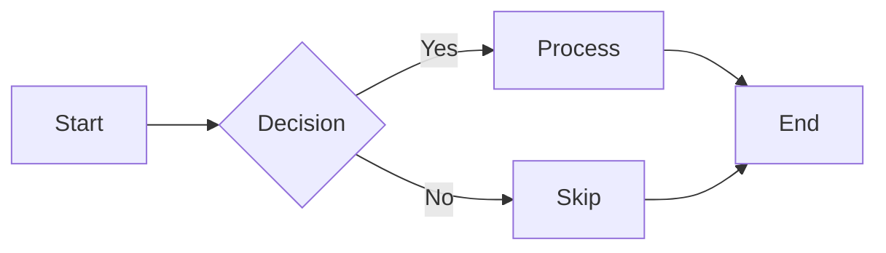
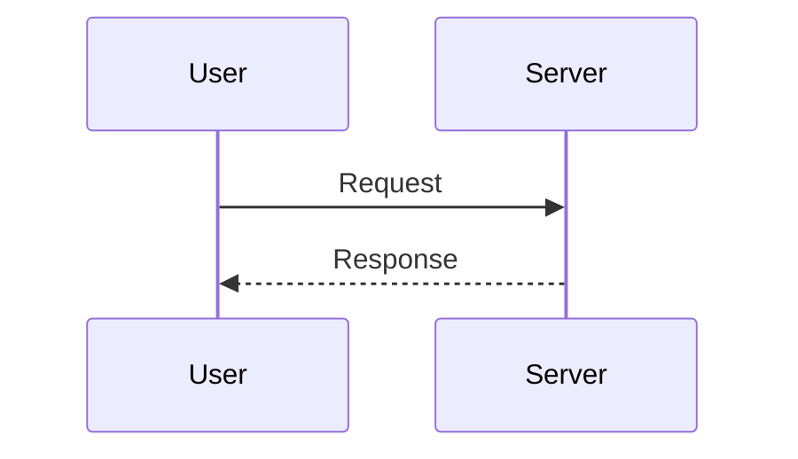
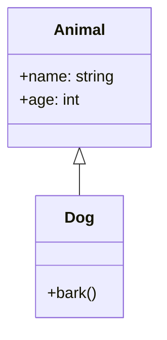
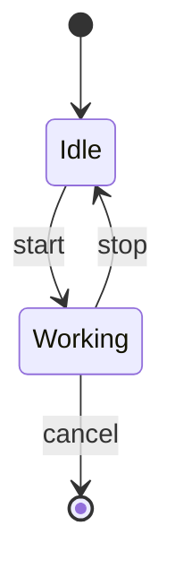
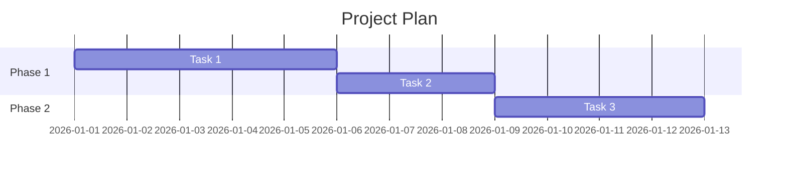

# Mermaid 5 Graphs

```mermaid
flowchart LR
  A[Start] --> B{Decision}
  B -->|Yes| C[Process]
  B -->|No| D[Skip]
  C --> E[End]
  D --> E
```

```mermaid
sequenceDiagram
  participant U as User
  participant S as Server
  U->>S: Request
  S-->>U: Response
```

```mermaid
classDiagram
  class Animal {
    +name: string
    +age: int
  }
  class Dog {
    +bark()
  }
  Animal <|-- Dog
```

```mermaid
stateDiagram-v2
  [*] --> Idle
  Idle --> Working: start
  Working --> Idle: stop
  Working --> [*]: cancel
```

```mermaid
gantt
  title Project Plan
  dateFormat YYYY-MM-DD
  section Phase 1
  Task 1: t1, 2026-01-01, 5d
  Task 2: t2, after t1, 3d
  section Phase 2
  Task 3: t3, after t2, 4d
```
