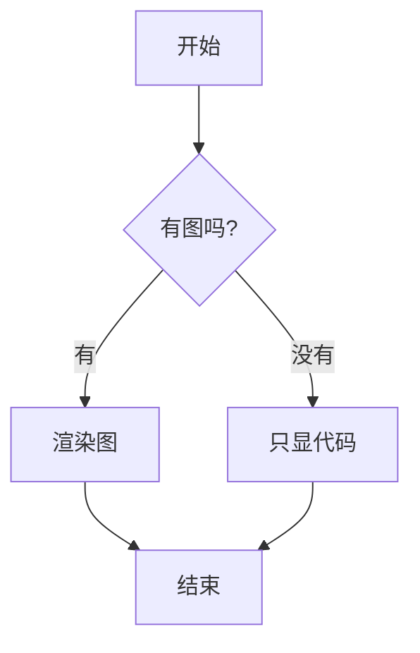
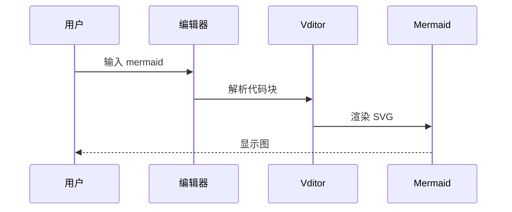
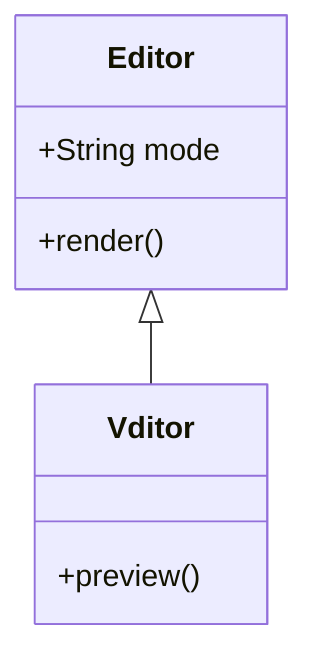

# Mermaid 测试

## 1. Flowchart

```mermaid
flowchart TD
    A[开始] --> B{有图吗?}
    B -->|有| C[渲染图]
    B -->|没有| D[只显代码]
    C --> E[结束]
    D --> E
```

## 2. Sequence

```mermaid
sequenceDiagram
    用户->>编辑器: 输入 mermaid
    编辑器->>Vditor: 解析代码块
    Vditor->>Mermaid: 渲染 SVG
    Mermaid-->>用户: 显示图
```

## 3. Class

```mermaid
classDiagram
    class Editor {
        +String mode
        +render()
    }
    class Vditor {
        +preview()
    }
    Editor <|-- Vditor
```

正文段落:这是 mermaid 测试文档,如果上面 3 段渲染成图就 OK,如果只显示代码就还没修。
